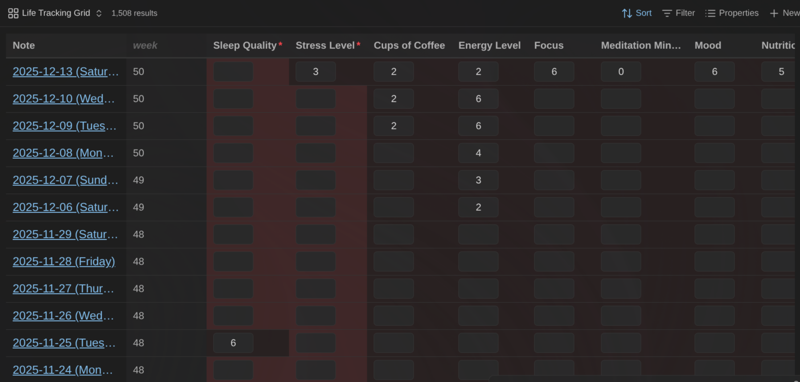
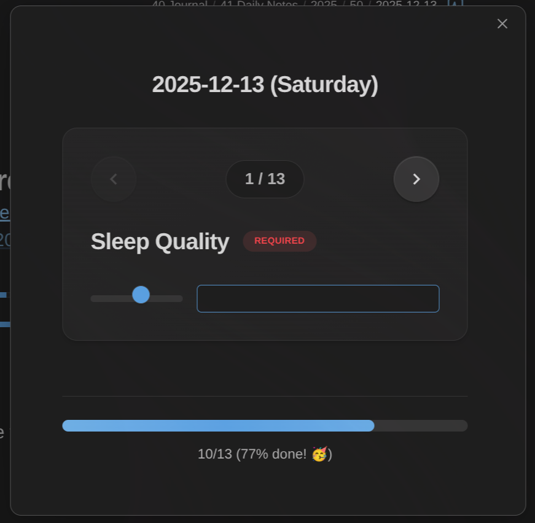
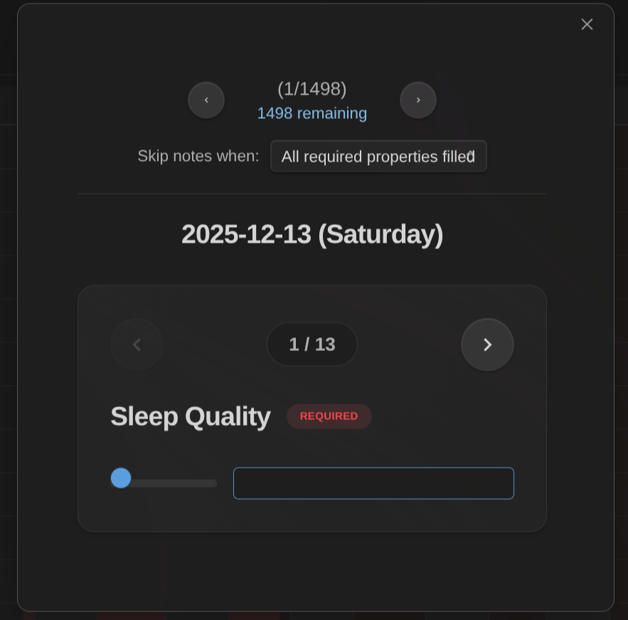
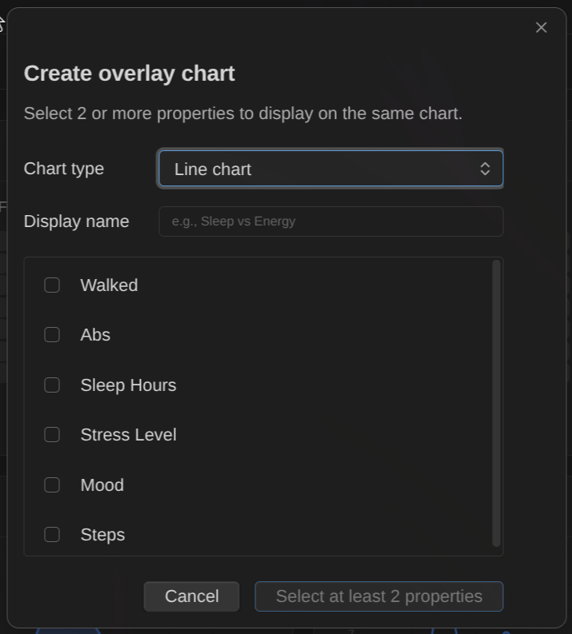
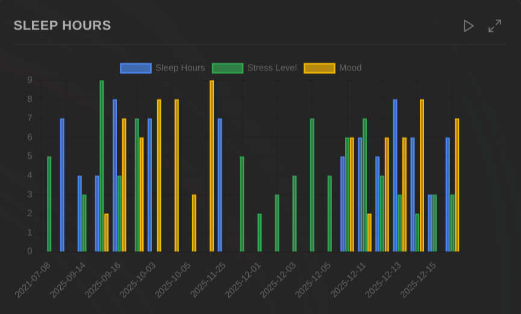
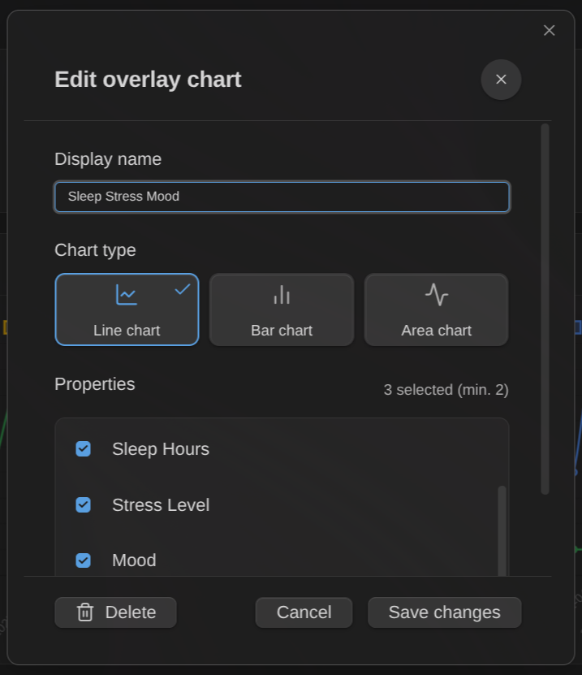

# Life Tracker Plugin for Obsidian

Capture and visualize the data that matters in your life. This Obsidian plugin adds a "Life Tracker" Base View type that transforms your tracked data into beautiful visualizations.

You can find more details and background information here: https://www.knowii.net/c/announcements/new-obsidian-plugin-life-tracker

## Overview/Demo Video

<!-- Generated by https://t.cuts.so/github/video -->

## Features

### Visualizations

- **12 visualization types**: Heatmap, Line, Bar, Area, Pie, Doughnut, Radar, Polar Area, Scatter, Bubble, Tag Cloud, Timeline
- **GitHub-style heatmaps** with 5 color schemes (green, blue, purple, orange, red)
- **Animated charts** with configurable duration and play/pause controls
- **Interactive elements**: click chart elements to open source notes, hover for detailed tooltips
- **Supports all property types**: frontmatter properties, Bases formulas, and file metadata (e.g., tags as tag cloud)

### Customization

- **Multiple visualizations per property**: add multiple visualization cards for the same property to compare different chart types or configurations side by side
- **Overlay charts**: combine multiple properties on a single chart to visualize correlations (e.g., sleep vs mood, exercise vs energy)
- **List property visualization**: list/tag properties automatically visualized with occurrence counts (pie/doughnut) or presence tracking over time (line/bar)
- **Per-view settings**: time granularity (daily to yearly), date anchor property, layout options
- **Time frame selection**: filter visualizations to show specific date ranges (all time, last 7/30/90/365 days, this week/month/quarter/year, etc.)
- **Grid layout controls**: adjustable columns (1-6)
- **Visualization presets**: auto-apply settings to properties by name pattern
- **Scale configuration**: auto-detect or manual min/max for numeric visualizations
- **Reference lines**: add horizontal target lines to cartesian charts (line, bar, area) to track values against goals (e.g., weight target)
- **Color schemes**: 5 chart color schemes (green, blue, purple, orange, red) for all chart types
- **Chart options**: toggle legend, grid lines, and more
- **Responsive resizing**: visualizations automatically adjust to available space

### Property Capture

- **Property definitions**: configure trackable properties with types (text, number, checkbox, date, list, tags), defaults, and constraints
- **Capture command**: quick dialog to fill properties for the active note or batch process multiple notes
- **Carousel interface**: navigate through properties one at a time with progress tracking
- **Batch mode**: process notes from Grid View or Life Tracker View with smart filtering (skip complete notes)
- **Auto-save**: values saved automatically as you type with visual feedback
- **Grid View**: card-based Base view type for editing properties across multiple notes

### User Experience

- **Context menu**: right-click any card to change visualization, configure scale and color scheme, maximize, or reset
- **Maximize mode**: expand any visualization to full view (press Escape to exit)
- **Persistent settings**: grid layout and card configurations saved per view
- **Empty states**: helpful messages when data is missing or misconfigured
- **Confetti celebration**: optional animation when completing property capture
- **Mobile support**: responsive grid (becomes cards view on smaller screens), mobile-friendly data entry modal

## Screenshots

### Dashboard with multiple visualizations

View your tracked data with different visualization types: area charts, heatmaps, bar charts, and line charts in a grid layout.

### Select visualization type

Choose from 12 visualization types when configuring a new property: Heatmap, Bar Chart, Line Chart, Area Chart, Pie Chart, Doughnut Chart, Radar Chart, Polar Area Chart, Scatter Chart, Bubble Chart, Tag Cloud, and Timeline.

### Customize time granularity

Set the time granularity for your visualizations: Daily, Weekly, Monthly, Quarterly, or Yearly.

### Configure view settings

Adjust layout options including number of columns, empty date display, default chart type, and legend visibility.

### Right-click context menu

Right-click any card to change visualization type, configure scale (auto-detect or preset ranges like 0-1, 0-5, 0-10, 0-100), color scheme, and reference lines, add another visualization for the same property, maximize, or reset configuration.

### Maximize view

Expand any visualization to full view for detailed analysis. Press Escape to exit.

### Global settings and presets

Configure animation duration and create visualization presets that auto-apply to properties matching specific name patterns.

### Life Tracking Grid

Use the Life Tracking Grid (custom base view) to quickly capture your data.

### Data Entry Modal

Use the "Life Tracker: Capture properties" command to capture data easily:

Invoked on a specific note:

Invoked in a Life Tracking Base view:

### Overlay Charts

Combine multiple properties on a single chart to visualize correlations and patterns:

Click "Create overlay" to select which properties to combine. Only cartesian chart types (Line, Bar, Area) support overlays.

View multiple properties together on a single chart with a shared time axis. Each property gets its own color and appears in the legend.

Right-click an overlay chart to edit its name, change the chart type, modify which properties are included, or delete it.

## Property definitions

Property definitions let you configure which frontmatter properties to track across your vault. Each definition specifies:

- **Property name**: The frontmatter key to track (e.g., `mood`, `weight`, `exercise`)
- **Type**: text, number, checkbox, date, datetime, list, or tags
- **Constraints**: Optional min/max for numbers, allowed values for text/list/tags
- **Default value**: Pre-filled when capturing new data
- **Note filtering**: Apply the property only to specific notes by folder, tag, or regex pattern
- **Reordering**: Drag and drop to reorder property definitions (affects modal and grid order)
- **Copy definitions**: Duplicate an existing property definition to quickly create similar ones

Configure property definitions in **Settings → Life Tracker → Property definitions**. These definitions power the capture command and determine which properties appear in the capture dialog.

## Life Tracking Grid

The Life Tracking Grid is a custom Base view type you can use to edit the different properties for which you have configured property definitions in the plugin settings.

This enables focusing on completing missing information in your notes.

The columns shown by this view correspond to the property definitions. If you show additional columns through the built-in "Properties" dropdown of Obsidian, those will be shown as read-only columns to the left of the property definitions. The idea behind this feature is that you can show additional information providing context for your data entry.

**Filtering options**: The Grid view supports two filtering options accessible via the view settings:

- **Time frame**: Filter notes by date range (all time, last 7/30/90/365 days, this week/month/quarter/year, etc.)
- **Hide notes when**: Automatically hide notes when all required properties (or all properties) are filled

## Data Entry Command and Modal

In version 1.2.0, a new command was added: "Life Tracker: Capture Properties".
That command behaves differently depending on where you invoke it from:

- If you invoke the command from a note that contains known properties (i.e., properties with property definitions in the plugin settings), it enables editing those properties one by one with a dedicated modal (carousel) that lets you fill-in the data and navigate between properties using the arrows
- If you invoke the command from one of the custom base views (Life Tracker or Life Tracking Grid), then it shows the same modal, but also lets you navigate between all the files included in the base view (aka bulk edit mode)

**Time frame integration**: When invoking the capture command from a base view with a time frame configured, only notes within that time frame are included in the batch. This lets you focus on capturing data for a specific period.

TIP: When working with a set of files (aka bulk edit mode), you can filter the files in the carousel to only include those that have missing required properties through the dropdown on the top.

## Visualization presets

Visualization presets automatically configure how properties are displayed based on their name. For example, you can set all properties containing "mood" to display as a heatmap with a 1-5 scale.

Configure presets in **Settings → Life Tracker → Visualization presets** by specifying:

- **Property name pattern**: The text to match against property names
- **Visualization type**: Which visualization to use (heatmap, line chart, etc.)
- **Scale**: Optional min/max range for numeric visualizations
- **Color scheme**: Optional color palette for chart types (green, blue, purple, orange, red)

**How presets work with overrides**: When you add a property column to a Life Tracker Base View, the plugin checks for matching presets and applies them automatically. However, you can always override the preset configuration for that specific property in that specific view using the right-click context menu. Your per-view overrides take precedence over presets, giving you global defaults with local flexibility.

## Roadmap

See the issues & discussions in this repositories.

## News & support

To stay up to date about this plugin, Obsidian in general, Personal Knowledge Management and note-taking, subscribe to [my newsletter](https://dsebastien.net). Note that the best way to support my work is to become a paid subscriber ❤️.
