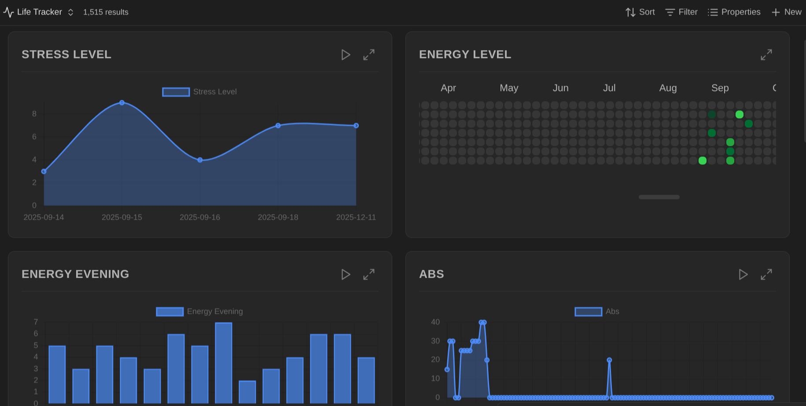
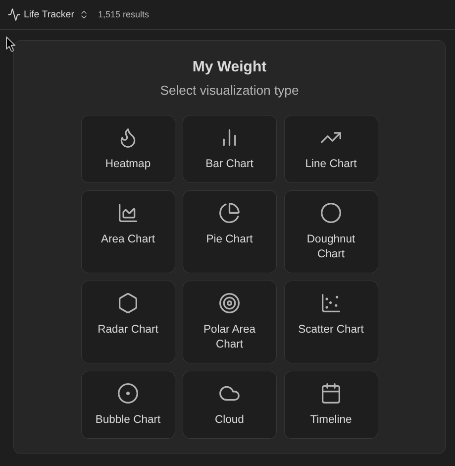
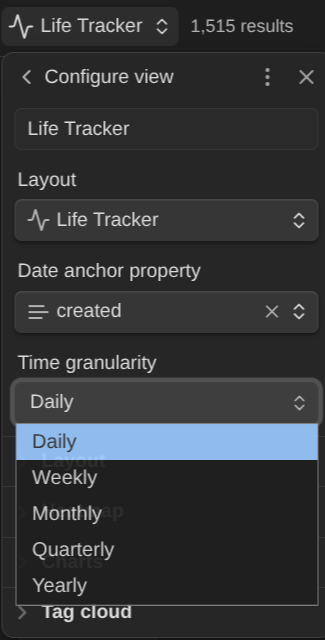
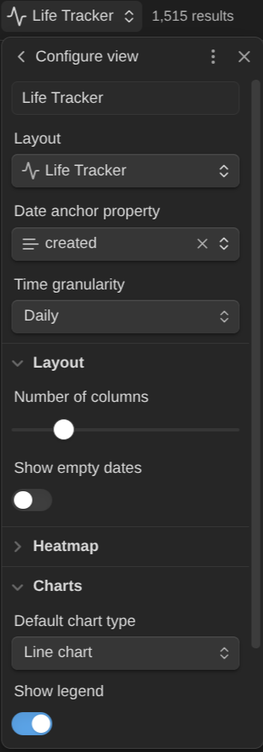
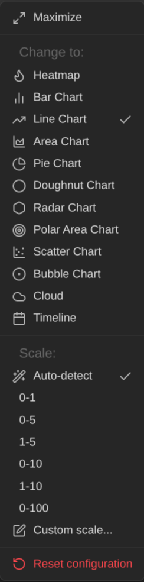
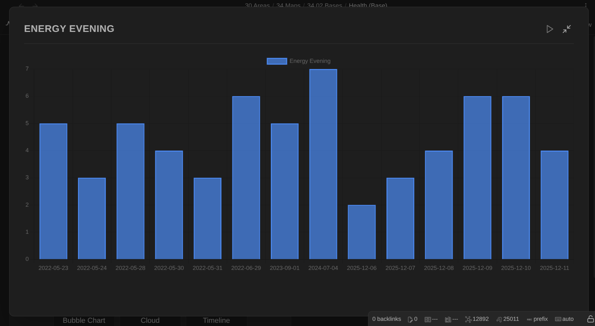
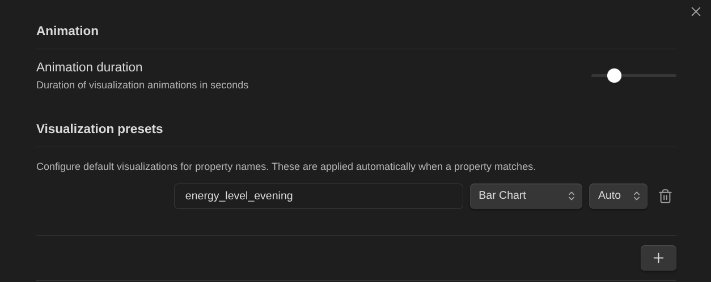

# Life Tracker Plugin for Obsidian

Capture and visualize the data that matters in your life. This Obsidian plugin adds a "Life Tracker" Base View type that transforms your tracked data into beautiful visualizations.

You can find more details and background information here: https://www.knowii.net/c/announcements/new-obsidian-plugin-life-tracker

## Features

### Visualizations

- **12 visualization types**: Heatmap, Line, Bar, Area, Pie, Doughnut, Radar, Polar Area, Scatter, Bubble, Tag Cloud, Timeline
- **GitHub-style heatmaps** with 5 color schemes (green, blue, purple, orange, red)
- **Animated charts** with configurable duration and play/pause controls
- **Interactive elements**: click chart elements to open source notes, hover for detailed tooltips

### Customization

- **Per-view settings**: time granularity (daily to yearly), date anchor property, layout options
- **Grid layout controls**: adjustable columns (1-6) and card height
- **Visualization presets**: auto-apply settings to properties by name pattern
- **Scale configuration**: auto-detect or manual min/max for numeric visualizations
- **Chart options**: toggle legend, grid lines, and more

### User Experience

- **Context menu**: right-click any card to change visualization, configure scale, maximize, or reset
- **Maximize mode**: expand any visualization to full view (press Escape to exit)
- **Persistent settings**: grid layout and card configurations saved per view
- **Empty states**: helpful messages when data is missing or misconfigured

## Screenshots

### Dashboard with multiple visualizations

View your tracked data with different visualization types: area charts, heatmaps, bar charts, and line charts in a grid layout.

### Select visualization type

Choose from 12 visualization types when configuring a new property: Heatmap, Bar Chart, Line Chart, Area Chart, Pie Chart, Doughnut Chart, Radar Chart, Polar Area Chart, Scatter Chart, Bubble Chart, Tag Cloud, and Timeline.

### Customize time granularity

Set the time granularity for your visualizations: Daily, Weekly, Monthly, Quarterly, or Yearly.

### Configure view settings

Adjust layout options including number of columns, empty date display, default chart type, and legend visibility.

### Right-click context menu

Right-click any card to change visualization type, configure scale (auto-detect or preset ranges like 0-1, 0-5, 0-10, 0-100), maximize, or reset configuration.

### Maximize view

Expand any visualization to full view for detailed analysis. Press Escape to exit.

### Global settings and presets

Configure animation duration and create visualization presets that auto-apply to properties matching specific name patterns.

## Roadmap

- Data capture UI: easily add/update data points for tracked properties
- Summaries and target goals/thresholds
- Custom time frame filtering per view
- Seasons as time granularity
- Improved per-property visualization settings UI

## News & support

To stay up to date about this plugin, Obsidian in general, Personal Knowledge Management and note-taking, subscribe to [my newsletter](https://dsebastien.net). Note that the best way to support my work is to become a paid subscriber ❤️.
