# Life Tracker Plugin for Obsidian

Capture and visualize the data that matters in your life. This Obsidian plugin adds a "Life Tracker" Base View type that transforms your tracked data into beautiful visualizations.

You can find more details and background information here: https://www.knowii.net/c/announcements/new-obsidian-plugin-life-tracker

## Overview/Demo Video

<!-- Generated by https://t.cuts.so/github/video -->

## Features

### Visualizations

- **12 visualization types**: Heatmap, Line, Bar, Area, Pie, Doughnut, Radar, Polar Area, Scatter, Bubble, Tag Cloud, Timeline
- **GitHub-style heatmaps** with 5 color schemes (green, blue, purple, orange, red) and average/sum aggregation for multi-entry days
- **Animated charts** with configurable duration and play/pause controls
- **Interactive elements**: click chart elements to open source notes, hover for detailed tooltips
- **Supports all property types**: frontmatter properties, Bases formulas, and file metadata (e.g., tags as tag cloud)

### Customization

- **Multiple visualizations per property**: add multiple visualization cards for the same property to compare different chart types or configurations side by side
- **Overlay charts**: combine multiple properties on a single chart to visualize correlations (e.g., sleep vs mood, exercise vs energy), with option to hide individual property cards
- **List property visualization**: list/tag properties automatically visualized with occurrence counts (pie/doughnut) or presence tracking over time (line/bar)
- **Per-view settings**: time granularity (daily to yearly), date anchor property, layout options
- **First day of the week**: choose Monday (default) or Sunday for week grouping and heatmap columns
- **Time frame selection**: filter visualizations to show specific date ranges (all time, last 7/30/90/365 days, this week/month/quarter/year, etc.)
- **Grid layout controls**: adjustable columns (1-6)
- **Drag-and-drop reordering**: rearrange any card (property or overlay) by dragging its grip handle; the custom order is saved per view and works on desktop and mobile
- **Visualization presets**: auto-apply settings to properties by name pattern
- **Scale configuration**: auto-detect or manual min/max for numeric visualizations
- **Reference lines**: add horizontal target lines to cartesian charts (line, bar, area) to track values against goals (e.g., weight target)
- **Color schemes**: 5 chart color schemes (green, blue, purple, orange, red) for all chart types
- **Chart options**: toggle legend, grid lines, and more
- **Responsive resizing**: visualizations automatically adjust to available space

### Property Capture

- **Property definitions**: configure trackable properties with types (text, number, checkbox, date, list, tags), defaults, and constraints
- **Capture command**: quick dialog to fill properties for the active note or batch process multiple notes
- **Carousel interface**: navigate through properties one at a time with progress tracking
- **Batch mode**: process notes from Grid View or Life Tracker View with smart filtering (skip complete notes)
- **Auto-save**: values saved automatically as you type with visual feedback
- **Grid View**: card-based Base view type for editing properties across multiple notes

### User Experience

- **Context menu**: right-click any card to change visualization, configure scale and color scheme, maximize, or reset
- **Maximize mode**: expand any visualization to full view (press Escape to exit)
- **Persistent settings**: grid layout and card configurations saved per view
- **Empty states**: helpful messages when data is missing or misconfigured
- **Confetti celebration**: optional animation when completing property capture
- **Mobile support**: responsive grid (becomes cards view on smaller screens), mobile-friendly data entry modal

## Screenshots

### Dashboard with multiple visualizations

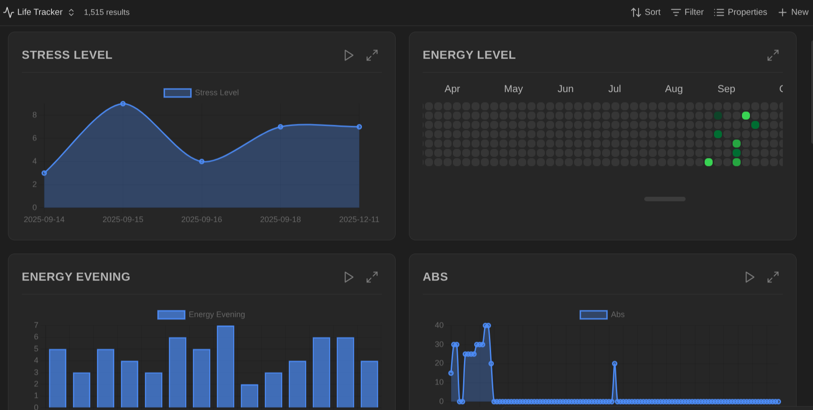
View your tracked data with different visualization types: area charts, heatmaps, bar charts, and line charts in a grid layout.

### Select visualization type

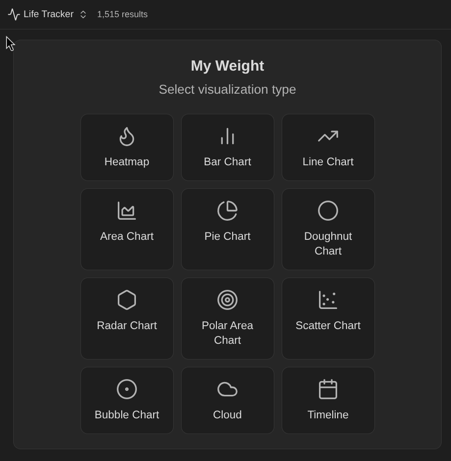
Choose from 12 visualization types when configuring a new property: Heatmap, Bar Chart, Line Chart, Area Chart, Pie Chart, Doughnut Chart, Radar Chart, Polar Area Chart, Scatter Chart, Bubble Chart, Tag Cloud, and Timeline.

### Customize time granularity

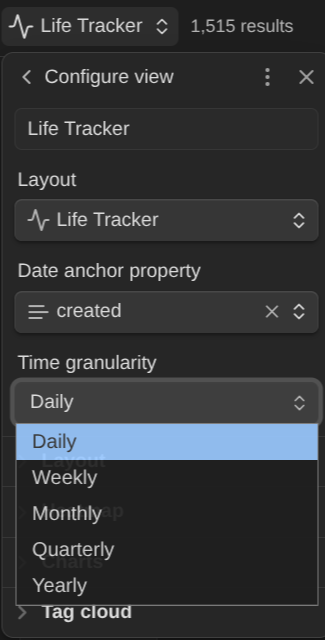
Set the time granularity for your visualizations: Daily, Weekly, Monthly, Quarterly, or Yearly.

### Configure view settings

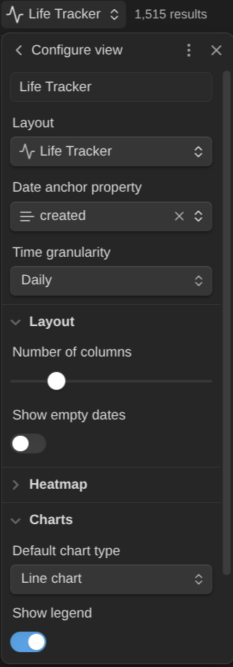
Adjust layout options including number of columns, empty date display, default chart type, and legend visibility.

### Right-click context menu

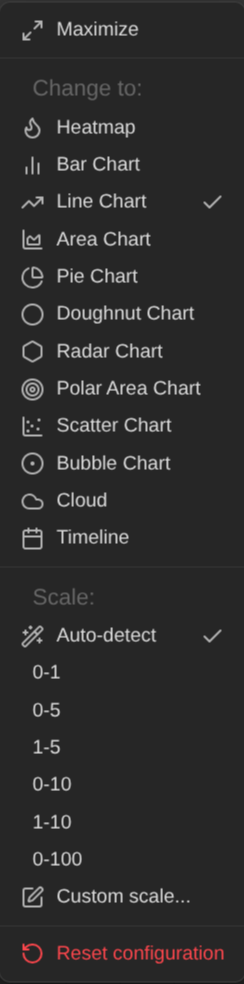
Right-click any card to change visualization type, configure scale (auto-detect or preset ranges like 0-1, 0-5, 0-10, 0-100), color scheme, reference lines, aggregation method (average or sum — useful when multiple entries share a date, e.g. summing workout calories per day), and a moving average for line/area charts (7/14/30 periods, drawn as a dashed line to smooth noisy data), add another visualization for the same property, maximize, export the chart as a PNG image or the displayed data as CSV (saved to your attachment folder), or reset configuration. Line, bar, and area charts also show a small trend arrow (↑/↓/→) next to the title comparing recent periods against the previous ones — hover it for the percentage change.

### Visualize list properties

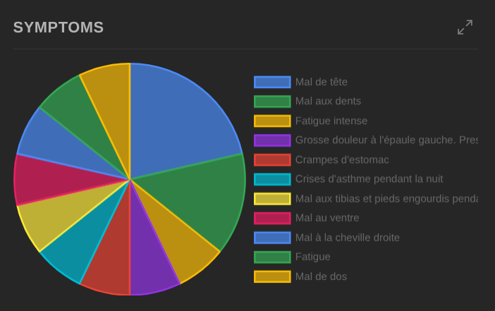
List and tag properties are visualized automatically: pie/doughnut charts count how often each value occurs, while line/bar charts track the presence of each value over time. Values are grouped case-insensitively.

### Maximize view

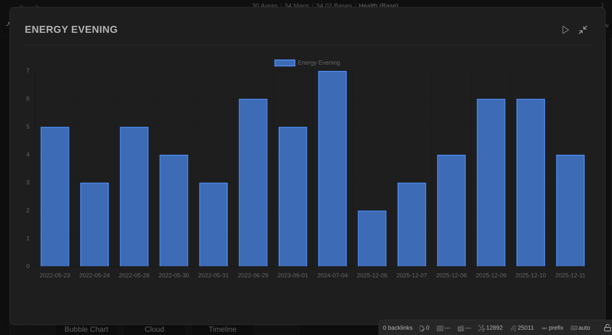
Expand any visualization to full view for detailed analysis. Press Escape to exit.

### Global settings and presets

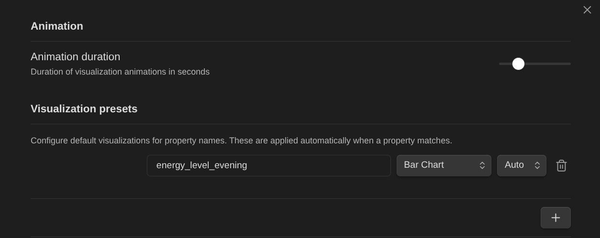

Configure animation duration and create visualization presets that auto-apply to properties matching specific name patterns.

### Life Tracking Grid

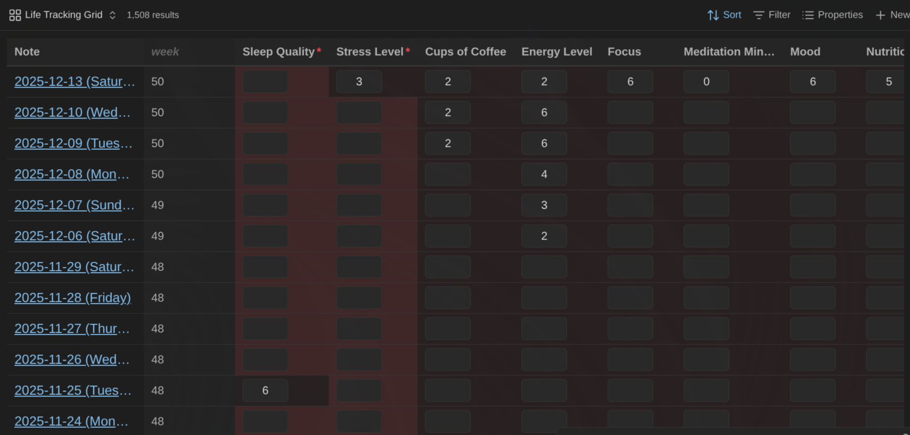

Use the Life Tracking Grid (custom base view) to quickly capture your data.

### Data Entry Modal

Use the "Life Tracker: Capture properties" command to capture data easily:

Invoked on a specific note:

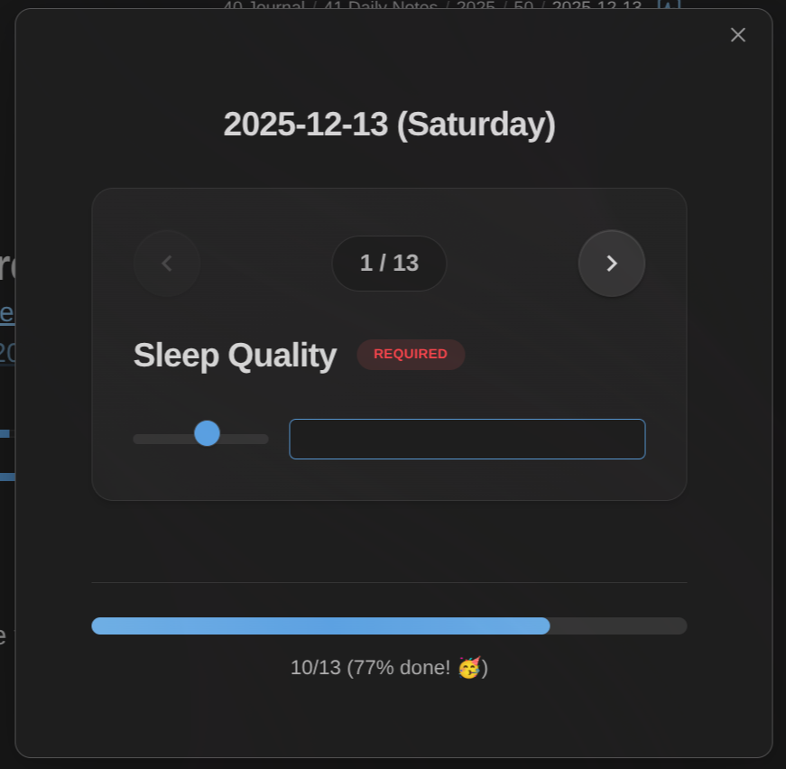

Invoked in a Life Tracking Base view:

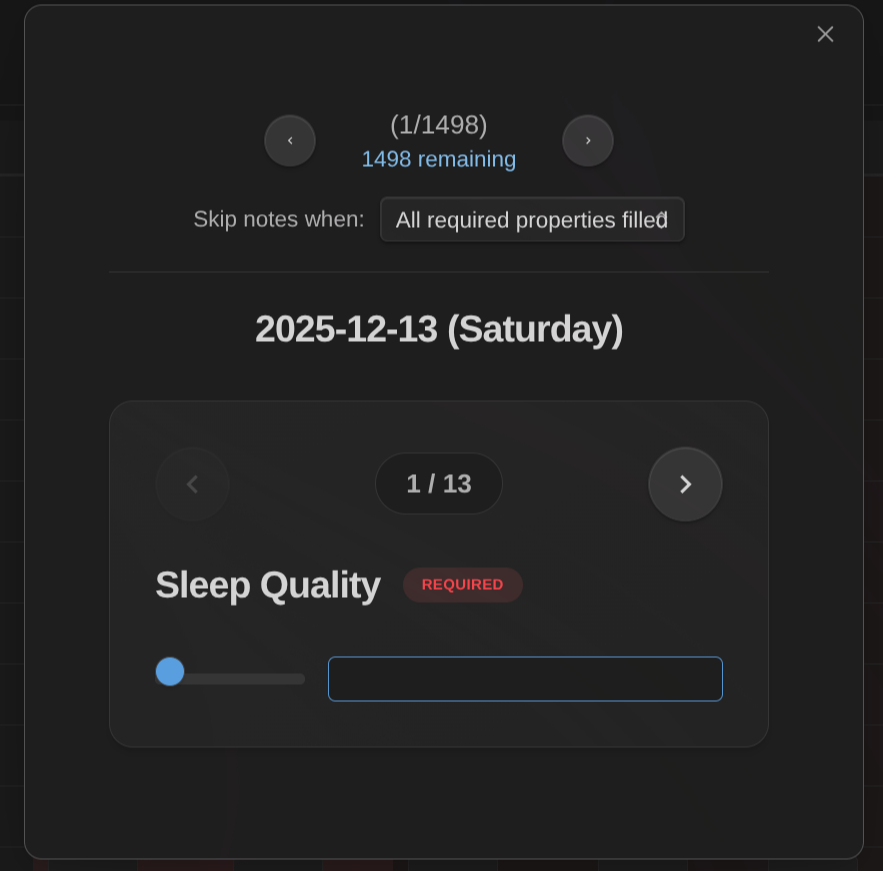

Use the "Life Tracker: Capture today" command to jump straight to today's daily note (named `YYYY-MM-DD`) and start capturing — no need to open the note first.

### Overlay Charts

Combine multiple properties on a single chart to visualize correlations and patterns:

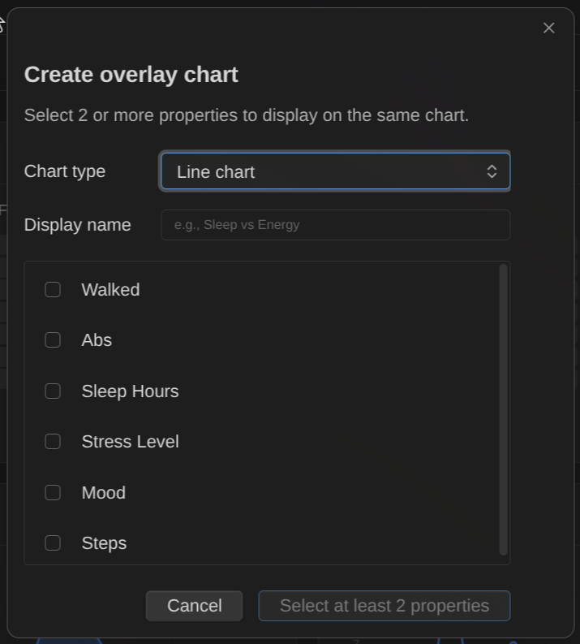

Click "Create overlay" to select which properties to combine. Only cartesian chart types (Line, Bar, Area) support overlays.

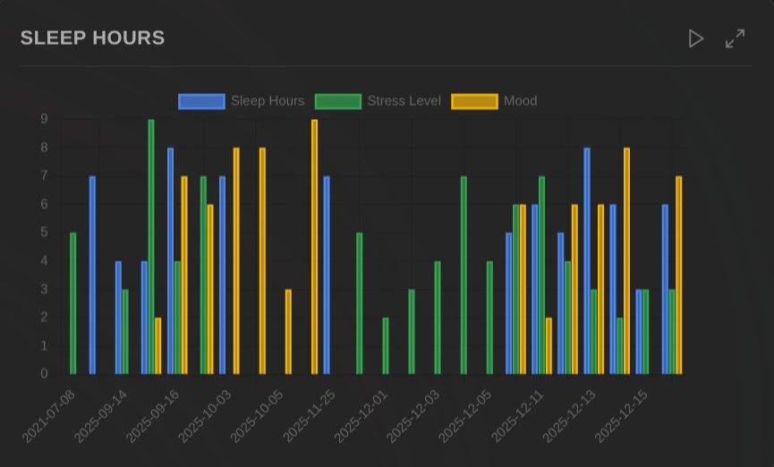

View multiple properties together on a single chart with a shared time axis. Each property gets its own color and appears in the legend.

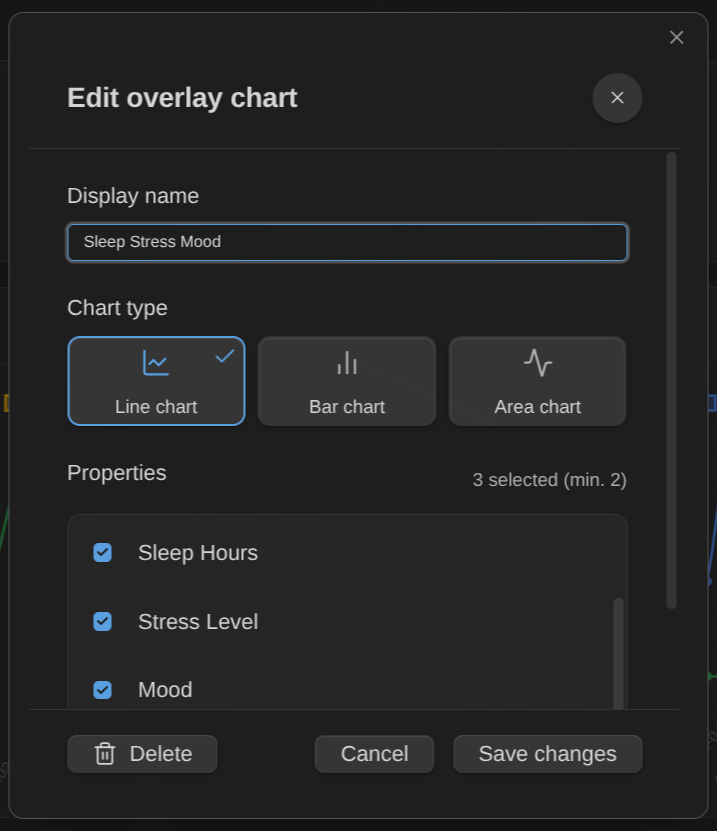

Right-click an overlay chart to edit its name, change the chart type, modify which properties are included, or delete it.

**Hide individual visualizations**: When editing an overlay, you can enable "Hide individual visualizations" to hide the separate cards for each property in the overlay. This reduces visual clutter when you only want to see the combined view.

## Property definitions

Property definitions let you configure which frontmatter properties to track across your vault. Each definition specifies:

- **Property name**: The frontmatter key to track (e.g., `mood`, `weight`, `exercise`)
- **Type**: text, number, checkbox, date, datetime, list, or tags
- **Constraints**: Optional min/max for numbers, allowed values for text/list/tags
- **Value mapping** (text properties): map text/emoji values to numbers so they can be charted — e.g. `⭐` → 1, `⭐⭐` → 2, or `bad`/`ok`/`great` → 1/2/3. Notes keep showing the original text; visualizations use the mapped numbers. Great for tracking mood or ratings with emoji.
- **Default value**: Pre-filled when capturing new data
- **Note filtering**: Apply the property only to specific notes by folder, tag, or regex pattern
- **Reordering**: Drag and drop to reorder property definitions (affects modal and grid order)
- **Copy definitions**: Duplicate an existing property definition to quickly create similar ones

Configure property definitions in **Settings → Life Tracker → Property definitions**. These definitions power the capture command and determine which properties appear in the capture dialog.

## Life Tracking Grid

The Life Tracking Grid is a custom Base view type you can use to edit the different properties for which you have configured property definitions in the plugin settings.

This enables focusing on completing missing information in your notes.

The columns shown by this view correspond to the property definitions. If you show additional columns through the built-in "Properties" dropdown of Obsidian, those will be shown as read-only columns to the left of the property definitions. The idea behind this feature is that you can show additional information providing context for your data entry.

**Filtering options**: The Grid view supports two filtering options accessible via the view settings:

- **Time frame**: Filter notes by date range (all time, last 7/30/90/365 days, this week/month/quarter/year, etc.)
- **Hide notes when**: Automatically hide notes when all required properties (or all properties) are filled

## Data Entry Command and Modal

In version 1.2.0, a new command was added: "Life Tracker: Capture Properties".
That command behaves differently depending on where you invoke it from:

- If you invoke the command from a note that contains known properties (i.e., properties with property definitions in the plugin settings), it enables editing those properties one by one with a dedicated modal (carousel) that lets you fill-in the data and navigate between properties using the arrows
- If you invoke the command from one of the custom base views (Life Tracker or Life Tracking Grid), then it shows the same modal, but also lets you navigate between all the files included in the base view (aka bulk edit mode)

**Time frame integration**: When invoking the capture command from a base view with a time frame configured, only notes within that time frame are included in the batch. This lets you focus on capturing data for a specific period.

TIP: When working with a set of files (aka bulk edit mode), you can filter the files in the carousel to only include those that have missing required properties through the dropdown on the top.

## Visualization presets

Visualization presets automatically configure how properties are displayed based on their name. For example, you can set all properties containing "mood" to display as a heatmap with a 1-5 scale.

Configure presets in **Settings → Life Tracker → Visualization presets** by specifying:

- **Property name pattern**: The text to match against property names
- **Visualization type**: Which visualization to use (heatmap, line chart, etc.)
- **Scale**: Optional min/max range for numeric visualizations
- **Color scheme**: Optional color palette for chart types (green, blue, purple, orange, red)
- **What's new after updates.** After a plugin update, a one-time dialog shows the release notes you just received (including skipped versions) with ways to support development. Never shown on fresh installs or regular restarts.

**How presets work with overrides**: When you add a property column to a Life Tracker Base View, the plugin checks for matching presets and applies them automatically. However, you can always override the preset configuration for that specific property in that specific view using the right-click context menu. Your per-view overrides take precedence over presets, giving you global defaults with local flexibility.

## Installation

### Community plugins (recommended)

1. In Obsidian, go to **Settings → Community plugins**.
2. Disable **Restricted mode** if it's enabled.
3. Select **Browse**, search for **Life Tracker**, install it, then enable it.

You can also browse the catalog on the [Obsidian Community](https://community.obsidian.md/) website.

### Manual installation

If the plugin isn't listed in the community catalog yet (or you want a specific version):

1. Download `main.js`, `manifest.json`, and `styles.css` from the [latest release](https://github.com/dsebastien/obsidian-life-tracker-base-view/releases).
2. Copy them into `<Vault>/.obsidian/plugins/life-tracker/`.
3. Reload Obsidian and enable **Life Tracker** in **Settings → Community plugins**.

### BRAT (bleeding edge)

[BRAT](https://github.com/TfTHacker/obsidian42-brat) (Beta Reviewers Auto-update Tool) installs plugins straight from a GitHub repo and keeps them updated automatically. Use this if you want the latest commits — **things might break**.

1. Install **Obsidian42 - BRAT** from **Settings → Community plugins → Browse** and enable it.
2. Run **BRAT: Add a beta plugin for testing** from the command palette.
3. Paste `https://github.com/dsebastien/obsidian-life-tracker-base-view`.
4. Select the latest version and confirm.
5. Enable **Life Tracker** in **Settings → Community plugins**.

## Roadmap

See the issues & discussions in this repositories.

<!-- other-plugins:start -->

## My other Obsidian plugins

| Plugin                                                                                                        | What it does                                                                                                                                  |
| ------------------------------------------------------------------------------------------------------------- | --------------------------------------------------------------------------------------------------------------------------------------------- |
| [Agentic Resource Discovery Server](https://github.com/dsebastien/obsidian-agentic-resource-discovery-server) | Local-first Agentic Resource Discovery publisher and registry that serves your AI skills and tools to agents over a local HTTP and MCP server |
| [Book Exporter](https://github.com/dsebastien/obsidian-book-exporter)                                         | Export books (one manifest note + linked chapter notes) to EPUB and PDF via Pandoc                                                            |
| [Bookshelf Base](https://github.com/dsebastien/obsidian-bookshelf)                                            | Display your notes as a visual bookshelf via a custom Bases view                                                                              |
| [Dataview Serializer](https://github.com/dsebastien/obsidian-dataview-serializer)                             | Serialize Dataview queries to Markdown, and keep the Markdown representation up to date                                                       |
| [Expander](https://github.com/dsebastien/obsidian-expander)                                                   | Replace variables across your vault using HTML comment markers. Supports static values and dynamic functions                                  |
| [Ghost Publish](https://github.com/dsebastien/obsidian-ghost-publish)                                         | Publish your vault notes to a Ghost blog with configurable presets for tags, newsletters, and frontmatter conventions                         |
| [Graph Explorer Base View](https://github.com/dsebastien/obsidian-graph-explorer-base-view)                   | A custom Bases view that renders notes as an interactive force-directed graph with explored/unexplored tracking                               |
| [Hidden Folders Access](https://github.com/dsebastien/obsidian-hidden-folders-access)                         | Index hidden root-level folders (e.g. .claude) so they appear in the file tree, metadata cache, and Bases                                     |
| [Journal Bases](https://github.com/dsebastien/obsidian-journal-base)                                          | Custom Base views for journaling and periodic reviews                                                                                         |
| [Kanban Action Planner](https://github.com/dsebastien/obsidian-kanban-action-planner)                         | Render your notes as configurable Kanban boards and calendars inside Bases, with statuses, ordering, relationships, and scheduling            |
| [Note Village](https://github.com/dsebastien/obsidian-note-village)                                           | A 2D pixel art village where your notes become villagers you can explore and chat with using AI                                               |
| [Obsidian Starter Kit](https://github.com/DeveloPassion/obsidian-starter-kit-plugin)                          | Adds strong typing support and powerful automation support for notes                                                                          |
| [Remarkable Synchronizer](https://github.com/dsebastien/obsidian-remarkable-sync)                             | Connect to the reMarkable cloud, list, download, and sync notebook pages as images                                                            |
| [Replicate](https://github.com/dsebastien/obsidian-replicate)                                                 | Use AI models with ease via the Replicate.com integration                                                                                     |
| [REST and MCP server](https://github.com/dsebastien/obsidian-cli-rest)                                        | Exposes CLI commands as RESTful API endpoints and an MCP server for AI tool integration                                                       |
| [Time Machine](https://github.com/dsebastien/obsidian-time-machine)                                           | Browse, compare, and restore previous versions of your notes using built-in file-recovery snapshots                                           |
| [Transcriber](https://github.com/dsebastien/obsidian-transcriber)                                             | Transcribe images to markdown using Ollama vision models                                                                                      |
| [Typefully](https://github.com/dsebastien/obsidian-typefully)                                                 | Publish social media posts with ease using the Typefully integration                                                                          |
| [Update Time](https://github.com/dsebastien/obsidian-update-time)                                             | Automatically update front matter to include creation and last update times                                                                   |

Everything I build is documented in [my newsletter](https://dsebastien.net/newsletter) and on [my YouTube channel](https://youtube.com/@dsebastien).

<!-- other-plugins:end -->

<!-- support-cta -->

## News & support

To stay up to date about this plugin, Obsidian in general, Personal Knowledge Management and note-taking:

- Subscribe to [my newsletter](https://dsebastien.net/newsletter)
- Subscribe to [my YouTube channel](https://youtube.com/@dsebastien)
- Join the [Knowii community](https://www.store.dsebastien.net/product/knowii-community/) and learn to organize your notes and put your knowledge to work, together with fellow knowledge workers

If this plugin is useful to you, here are the best ways to support my work ❤️:

- [Join the Knowii community](https://www.store.dsebastien.net/product/knowii-community/)
- [Become a GitHub Sponsor](https://github.com/sponsors/dsebastien)
- [Buy me a coffee](https://www.buymeacoffee.com/dsebastien)
- [Subscribe to my YouTube channel](https://youtube.com/@dsebastien)
- [Check out my products](https://store.dsebastien.net)

Found a bug or have an idea? [Open an issue](https://github.com/dsebastien/obsidian-life-tracker-base-view/issues).
